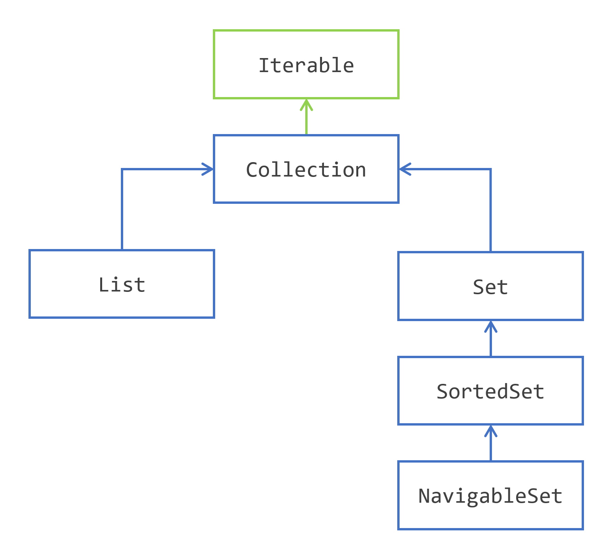
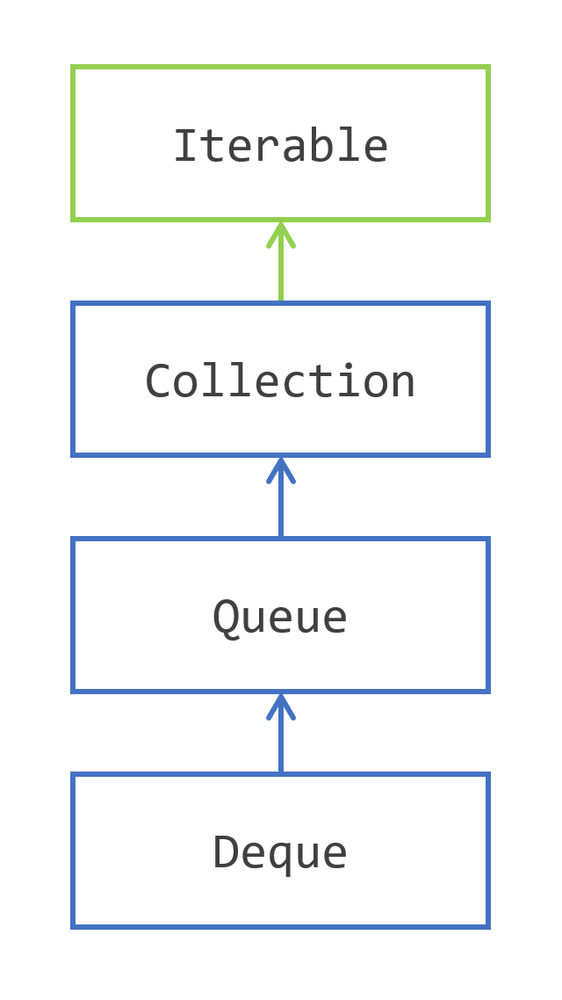
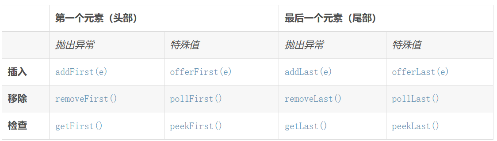
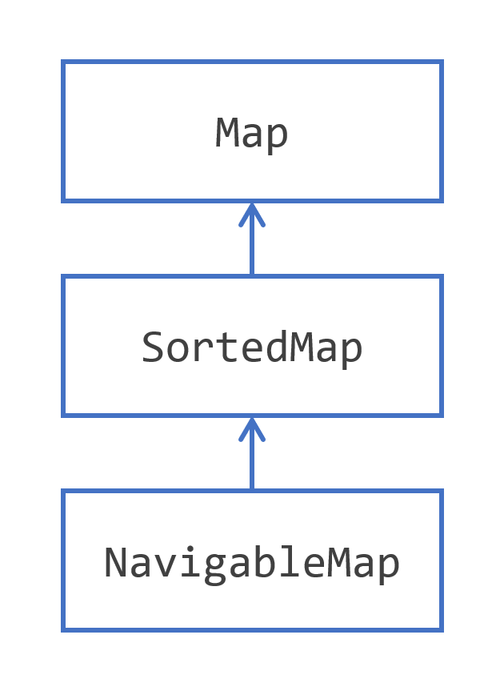

[TOC]
# Collections Framework: 
## 1.collection
### 概述  
* The Collection Interface Hierarchy

* Collection常用方法
    * **add，remove，contains**
    * **containsAll(), addAll(), removeAll() retainAll()：两个集合的并**
    * **size(), isEmpty(),clear(）**
    * **toArray(String[]::new);**
    * **removeIf(Predicate<? super E> filter)**
    * **of()创建不可变结构，但是如果是一个Java类，允许修改对象里面的字段，因为不会更改这类的地址**
        ```
        List<UseForTest> a = List.of(new UseForTest(1, "a"), new UseForTest(2,"b"));
        a.get(0).setName("aaa");
        ```
* Collections 静态函数
    * ``` min(),max()```
    

### Iterator
***不要使用Iterator迭代同时修改***
```
for (String element : strings) {
    strings.remove(element); //throws ConcurrentModificationException
}
strings.removeIf(a->true) //正确操作
iterator.remove()

```
### 一、List
**与Collectio区别：** 
* remembers in what order its elements have been added.
* have an index


**常用方法**
* **创建**
    * ```new ArrayList<>(List.of(...)); ```
    * Arrays.asList()**相当于数组，不能改变大小，增加删除元素，可以修改元素**
* **增删改查**
    * add(index, element)
    * get(index)
    * set(index, element)
    * remove(index)
    * ```removeif```(Perdiect)
* indexOf(element) and lastIndexOf(element) 
    * return the index of the given element in the list, or -1 if the element is not found.
* subList(start, end) 
    * the returned list is a **view** on the main list
    * any modification operation on the sublist is **reflected on the main list**
* *Collections.unmodifiableList()*: **不可变**
* ```indexOfSublist(List<?> source, List<?> target)```:returns the first index of the first element of the target list in the source list, or -1 if it does not exist;
    ```lastIndexOfSublist(List<?> source, List<?> target)```:return the last of these indexes.
* **swap(),reverse(),sort()**
## 二、 Set
#### 1. 与Collectio区别：** 
* do not have duplicates

#### SortedSet
1) 实现
    * **implement the Comparable interface, and provide a compareTo() method**
    * **give a Comparator**
2) 构建 
```SortedSet<String> strings = new TreeSet<>(Set.of("a", "b", "c", "d", "e", "f"));```
3) 方法
    * first() and last() 
        returns **the lowest** and **the largest**elements of the set
    * headSet(toElement) and tailSet(fromElement) 
        返回**小于**toElement的元素
        返回**大于等于**fromElement的元素
    * subSet(fromElement, toElement) 
        * gives you a subset of the element **between** fromElement and toElement.
        * **左闭右开**
    * **These three subsets remember the limits on which they have been built.**
### NavigableSet
https://dev.java/learn/api/collections-framework/sets/
1. 在SortedSet基础上提供更复杂的导航功能
1. 重载方法
    > headSet(), tailSet(),  subSet() 有布尔变量判断是否包含(toElement or fromElement)
2. 新增方法
    * ceiling(element) 和 floor(element)：
        >   返回大于或等于给定元素的最小元素
            返回小于或等于给定元素的最大元素
            如果没有这样的元素，则返回 null。
            **floor<=x<=ceil**
    * higher(element)和lower(element)  ：
        >   返回大于给定元素的最小元素
            返回小于给定元素的最大元素
            如果没有这样的元素，则返回 null。
            **lower<x<higher**
    * pollFirst() 和 pollLast()：
    返回并移除集合中的最小或最大元素。
3. 新增遍历
    >descendingSet()返回降序NavigableSet
    descendingIterator(): 返回降序迭代器


### TreeSet
1. TreeSet 是一个实现了 SortedSet 和 NavigableSet 接口的具体类

## Queue 和Deque

### 三种实现类
* new LinkedList<>();
* ArrayDeque
* PriorityQueue
### Queue方法
* add(E e) 和 offer(E e)
* remove() 和 poll()
* element() 和 peek() 获取队列头部的元素，但不移除

### Deque 方法

## 2.map

### 概览
1. **创建**
    * Map.of() 
    ```
    Map<Integer, String> map = 
        Map.of(
            1, "one", 
            2, "two",
            3, "three"
        );
        
    ```
    * Map.entry()
    ```java
    Map<Integer, String> map3 = 
    Map.ofEntries(
        Map.entry(1, "one"),
        Map.entry(2, "two"),
        Map.entry(3, "three")
    );

    ```
2. **Map.Entry**
* getKey(): to read the key;
* getValue() and setValue(value): to read and update the value bound to that key.
3. **增删改**
    * put(key, value) //返回key之前对应的value
    * putIfAbsent()，可以去掉null值
    ```java
    for (String key : map.keySet()) {
    map.putIfAbsent(key, -1);
    }
    ```
    * get(),getOrDefault() 
    * remove(key),remove(key,value)
    * containsKey(key) and containsValue(value)
    * isEmpty(),size(),clear() 
    * putAll(otherMap). If some keys are present in both maps, then the values of otherMap will erase those of this map.
4. **View**
- **keySet()**: Returns an instance of `Set`, containing the keys defined in the map.  

- **entrySet()**: Returns an instance of `Set<Map.Entry>`, containing the key/value pairs contained in the map.  

- **values()**: Returns an instance of `Collection`, containing the values present in the map.
5. **迭代**
```
for (Map.Entry<Integer, String> entry : map.entrySet()) {
    System.out.println("entry = " + entry);
}
```
