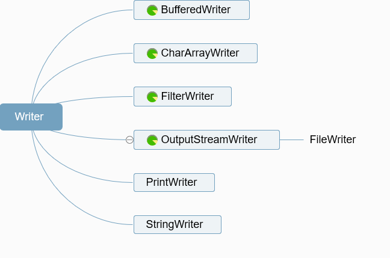

# IO

**InputStream 类**

- `int read()`：读取数据
- `int read(byte b[], int off, int len)`：从第 off 位置开始读，读取 len 长度的字节，然后放入数组 b 中
- `long skip(long n)`：跳过指定个数的字节
- `int available()`：返回可读的字节数
- `void close()`：关闭流，释放资源

**OutputStream 类**

- `void write(int b)`： 写入一个字节，虽然参数是一个 int 类型，但只有低 8 位才会写入，高 24 位会舍弃（这块后面再讲）
- `void write(byte b[], int off, int len)`： 将数组 b 中的从 off 位置开始，长度为 len 的字节写入
- `void flush()`： 强制刷新，将缓冲区的数据写入
- `void close()`：关闭流

**Reader 类**

- `int read()`：读取单个字符
- `int read(char cbuf[], int off, int len)`：从第 off 位置开始读，读取 len 长度的字符，然后放入数组 b 中
- `long skip(long n)`：跳过指定个数的字符
- `int ready()`：是否可以读了
- `void close()`：关闭流，释放资源

**Writer 类**

- `void write(int c)`： 写入一个字符
- `void write( char cbuf[], int off, int len)`： 将数组 cbuf 中的从 off 位置开始，长度为 len 的字符写入
- `void flush()`： 强制刷新，将缓冲区的数据写入
- `void close()`：关闭流

#### 字符流

##### Writer

    Writer append​( char c) 将指定的字符附加到此作者
    Writer append​(CharSequence csq) 将指定的字符序列附加到此作者
    Writer append​(CharSequence csq,  int start,  int end) 将指定字符序列的子序列附加到此作者 
    abstract void close​() 关闭流，先刷新
    abstract void flush​() 刷新流 
    void write​( char [] cbuf) 写入一个字符数组。 
    abstract void write​( char [] cbuf,  int off,  int len) 写入字符数组的一部分 
    void write​( int c) 写一个字符 
    void write​(String str) 写一个字符串 
    void write​(String str,  int off,  int len) 写一个字符串的一部分

#### 转换流
    InputStreamReader字节输入流转为字符输入流，
    OutputStreamWriter字符输出流转为字节输出流。
