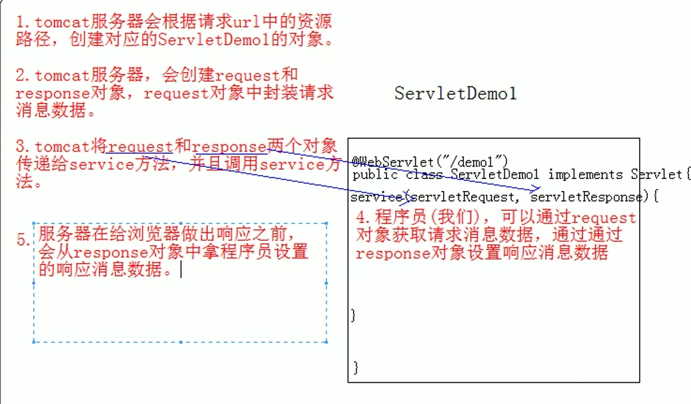

# servlet

## 生命周期

1. 初始化后调用 init () 方法。
2. 调用 service() 方法来处理客户端的请求。
3. 销毁前调用 destroy() 方法。
## HttpServlet
* 继承Servlet
* service() 方法检查 HTTP 请求类型（GET、POST、PUT、DELETE 等），并在适当的时候调用 doGet、doPost、doPut，doDelete 等方法。
## webxml
```
<servlet>
<load-on-startup>1</load-on-startup>
<servlet>
```
当值为0或者大于0时，容器在应用启动时就加载这个servlet；
当是一个负数时或者没有指定时,容器在该servlet被选择时才加载。
正数的值越小，启动该servlet的优先级越高
## @WebServlet
```
@WebServlet("/annotation")
public class Annotation implements Servlet {
    
}

```


value指定访问路径
```
/*代表任何路径
*.do 前面不能有任何的/
```

## http协议
* 数据格式
1. 请求行
请求方式 请求url 请求协议/版本
GET /servlet1/ HTTP/1.1

2. 请求头
Host: localhost:8082
Sec-Fetch-Dest: document
Sec-Fetch-Mode: navigate
3. 空行
4. 请求体
* GET 参数在url上
* POST 参数在请求体中
# request & response


1. request对象和response对象的原理
    1. request和response对象是由服务器创建的。我们来使用它们
    2. request对象是来获取请求消息，response对象是来设置响应消息
2. request对象继承体系结构:
ServletRequest 接口
HttpservletRequest 接口
org.apache.catalina.connector.RequestFacade 类(tomcat)实现
## 功能:
    * 获取请求消息
    1. 请求行
        1. 获取虚拟目录: string getcontextPath() **tomcat配置的**
        3. 获取请求URI:
        * string getRequestURI(): day14/demo1
        * stringBuffer getRequestURL(): http:// ~
        4. 获取客户机的IP地址:String getRemoteAddr()
    2. 请求头
        * String getHeader(String)
    3. 请求体
        * BufferedReader getReader() 字符流
        * ServletInputStream getInputStream() 字符流
    4. 其它
        * 获取请求参数String getParameter(string name)
        * Map<string,string[]> getParameterMap():获取所有参数的map集合
## 中文乱码问题:
* get方式:tomcat8已解决
* post方式:设置request的编码
    **request.setcharacterEncoding("utf-8”);**

## 转发
    getRequestDispatcher(String path).forward(request,response)
## 共享数据
* 域对象: 一个有作用范围的对象，可以在范围内共享数据
* request域:代表一次请求的范围，一般用于请求转发的多个资源中共享数据
``` 
void setAttribute(string name,object obj)
0bject getAttitude(string name)
void removeAttribute(string name)
```

# Threadlocal