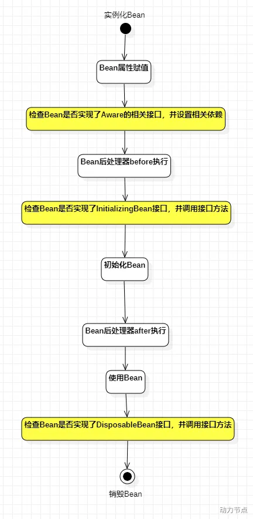

#### Bean实例化方式
1. 构造方法实例化

调用Bean的无参数构造方法


2. 简单工厂模式
```
public class Vip {
}

public class VipFactory {
    public static Vip get(){
        return new Vip();
    }
}

<bean id="vipBean" class="VipFactory" factory-method="get"/>
```
3. factory-bean

```
public class Order {
}

public class OrderFactory {
    public Order get(){
        return new Order();
    }
}

<bean id="orderFactory" class="OrderFactory"/>
<bean id="orderBean" factory-bean="orderFactory" factory-method="get"/>
```
4. FactoryBean接口
当你编写的类直接实现FactoryBean接口之后，factory-bean不需要指定了，factory-method也不需要指定了。
factory-bean会自动指向实现FactoryBean接口的类，factory-method会自动指向getObject()方法。


```
public class PersonFactoryBean implements FactoryBean<Person> {

    @Override
    public Person getObject() throws Exception {
        return new Person();
    }

    @Override
    public Class<?> getObjectType() {
        return null;
    }

    @Override
    public boolean isSingleton() {
        // true表示单例
        // false表示原型
        return true;
    }
}
<bean id="personBean" class="PersonFactoryBean"/>
```
##### BeanFactory和FactoryBean的区别

BeanFactory 是**工厂**
Spring IoC容器的顶级对象，BeanFactory被翻译为“Bean工厂”，在Spring的IoC容器中，“Bean工厂”负责创建Bean对象。

FactoryBean 是**Bean**
FactoryBean：它，是一个能够辅助Spring实例化其它Bean对象的一个Bean。
在Spring中，Bean可以分为两类：
* 普通Bean
* 工厂Bean（工厂Bean也是一种Bean，它可以辅助Spring实例化其它Bean对象）。


####  Bean生命周期

1. 只有正常关闭spring容器，bean的销毁方法才会被调用。
2. ClassPathXmlApplicationContext类才有close()方法。
3. 配置文件中的init-method指定初始化方法。destroy-method指定销毁方法。
4. 实现BeanPostProcessor类，并且重写before和after方法


● 对于singleton作用域的Bean，Spring 能够精确地知道该Bean何时被创建，何时初始化完成，以及何时被销毁；
● 而对于 prototype 作用域的 Bean，Spring 只负责创建，当容器创建了 Bean 的实例后，Bean 的实例就交给客户端代码管理，Spring 容器将不再跟踪其生命周期。

---
#### Bean的循环依赖

A对象中有B属性。B对象中有A属性

* **singleton + set**注入的情况下，循环依赖是没有问题的
* 只有A B**同时**prototype时会出现问题
* **构造方法**注入无法解决，因为构造方法注入会导致实例化对象的过程和对象属性赋值的过程没有分离开

##### 三级缓存：
key存储bean名称
单例对象的缓存：value存储Bean对象【一级缓存】
早期单例对象的缓存：value存储早期的Bean对象【二级缓存】
单例工厂缓存：value存储该Bean对应的ObjectFactory对象【三级缓存】

Spring只能解决setter方法注入的单例bean之间的循环依赖。Spring在创建ClassA对象后，不需要等给属性赋值，直接将其曝光到bean缓存当中。在解析ClassA的属性时，又发现依赖于ClassB，再次去获取ClassB，当解析ClassB的属性时，又发现需要ClassA的属性，但此时的ClassA已经被提前曝光加入了正在创建的bean的缓存中，则无需创建新的的ClassA的实例，直接从缓存中获取即可。从而解决循环依赖问题。


----